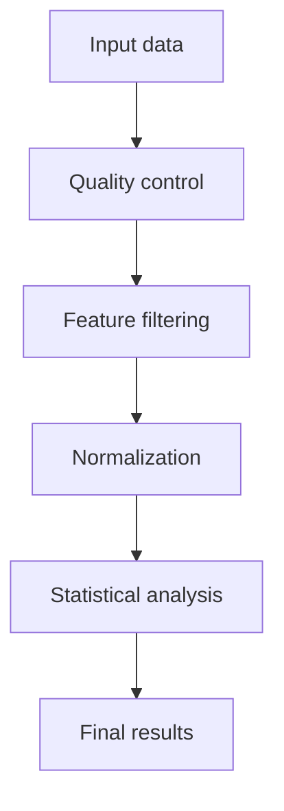
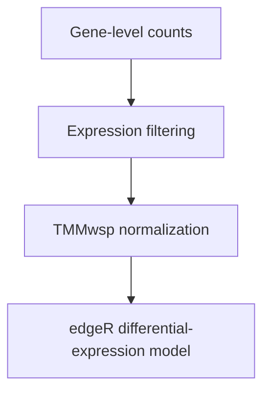
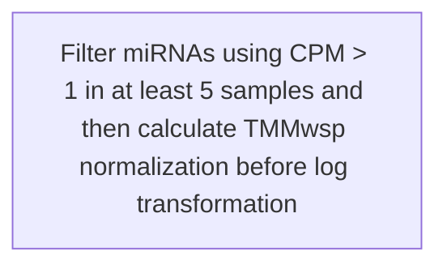
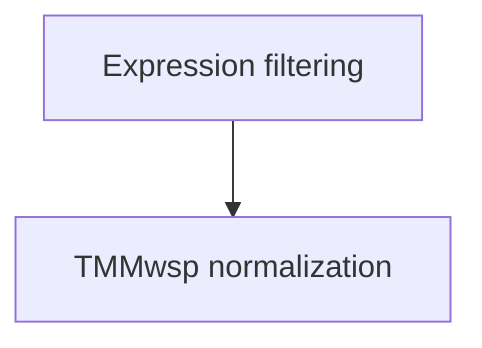
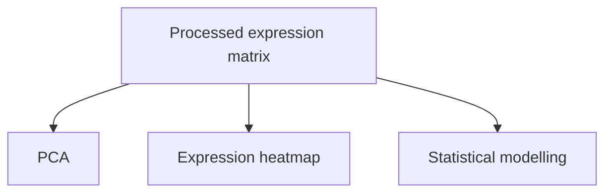
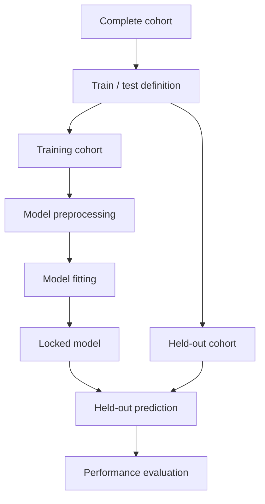
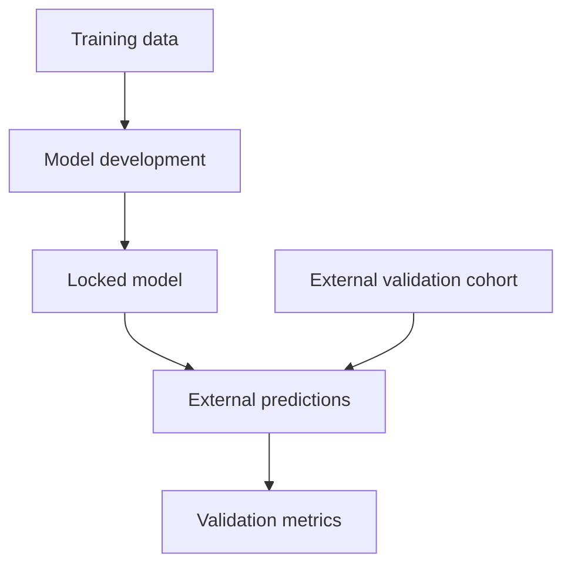
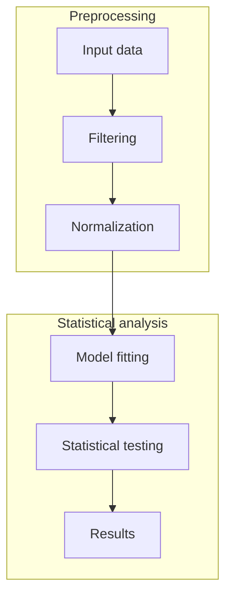

# Scientific Methods documentation prompt

Reusable instructions for producing Methods-style documentation from a
computational biology repository.

You are working locally inside this computational biology repository.

Your task is to go through the repository **folder by folder and notebook by notebook** and create or improve `README.md` files that describe the analyses in a detailed, scientific, and readable way.

The documentation should resemble the **Methods section of a computational biology paper**, not technical developer documentation.

The main goal is that my PI or another computational biologist can read the README files and understand:

- what was analysed;
- which data were used;
- how the data were processed;
- which statistical or computational methods were applied;
- which libraries and tools were used;
- which important parameters were used;
- how the different analyses connect;
- what the main outputs represent.

The reader should be able to reconstruct the **logic and methodology of the analysis** without needing to inspect every line of code or repeatedly ask me how things were done.

Do not focus on technical auditing, code quality, warnings, or repository problems. This task is primarily **descriptive scientific documentation**.

---

# 1. Inspect the repository first

Before writing documentation, recursively inspect the repository.

Read the relevant:

- `.qmd`
- `.Rmd`
- `.R`
- `.py`
- `.ipynb`
- workflow files
- configuration files
- existing README files

For notebooks, inspect the actual code and Markdown cells.

Do not infer the analysis only from filenames.

Understand what each notebook does and how the notebooks and folders relate to one another before writing the README files.

---

# 2. Do not modify the scientific code

This task is documentation only.

Do not modify:

- analysis logic;
- statistical tests;
- thresholds;
- models;
- sample definitions;
- figures;
- outputs;
- notebook code.

Create or improve the `README.md` documentation only.

---

# 3. Create README files for meaningful analysis folders

Create or expand a `README.md` for every folder that represents a meaningful analysis unit.

For example:

```text
01_QC/
02_preprocessing/
03_batch_effect/
04_differential_expression/
05_models/
06_validation/
07_pathway_analysis/
```

Do not create README files in every tiny technical directory.

The README should describe the **scientific analysis contained in that folder**.

---

# 4. Scientific writing style

Write the Methods sections using complete scientific prose.

Avoid documentation such as:

> - Load data
> - Normalize
> - Run PCA
> - Run edgeR

Instead write something like:

> Gene-level expression measurements were imported and matched to sample-level metadata using the common sample identifiers. Lowly expressed features were removed before downstream analysis according to the filtering criterion implemented in the notebook. Between-library normalization was then performed using the specified normalization method. Exploratory sample structure was evaluated using principal-component analysis, while differential-expression testing was performed using the statistical framework described below.

The README should feel similar to **Supplementary Computational Methods** from a scientific manuscript.

---

# 5. Recommended README structure

Use a structure similar to:

```markdown
# Analysis title

> **Purpose:** Short description of the biological or computational objective.

## Overview

## Workflow

```mermaid
...
```

## Data and cohort

## Input data

## Methods

### Data preparation
### Filtering
### Normalization
### Transformation
### Quality control
### Exploratory analysis
### Statistical analysis
### Validation
### Visualization

## Software and libraries

## Important parameters

## Notebooks and scripts

## Outputs

## Relationship to other analyses

## Analysis reconstruction
```

Only include subsections that are relevant to the folder.

---

# 6. Overview

The overview should explain:

- what scientific question is being addressed;
- what type of data are analysed;
- which cohort or samples are involved;
- where this step sits in the larger project;
- what the main result of the analysis is.

Do not simply describe the folder contents.

---

# 7. Data and cohort

When information is available in the notebooks, describe:

- assay type;
- dataset;
- number of samples;
- sample groups;
- train/test cohort;
- responders/non-responders;
- batches;
- biological conditions;
- clinical outcome definitions;
- external validation cohort.

If the sample composition changes during the workflow, explain the relevant change.

Only include numbers that are clearly supported by the repository.

---

# 8. Input data

Describe the important input files or objects.

Do not only list filenames.

For example, instead of:

> `mirna_matrix.tsv`

write:

> `mirna_matrix.tsv` contains the sample-level miRNA expression matrix used as the starting point for downstream filtering and statistical analysis.

Use a table when useful:

| Input | Description |
|---|---|
| `metadata.tsv` | Sample-level clinical and experimental metadata |
| `expression.tsv` | Feature-by-sample expression matrix |
| `signature.tsv` | Predefined candidate feature signature used for downstream evaluation |

---

# 9. Describe preprocessing precisely

Explain how the data are prepared before analysis.

Document steps such as:

- sample matching;
- feature matching;
- transposition;
- missing-value handling;
- filtering;
- normalization;
- logarithmic transformation;
- Z-scoring;
- annotation;
- factor-level definition.

For example:

> CPM values were transformed using `log2(CPM + 1)` before downstream visualization and predictive analysis.

If scaling is used:

> Features were centered and standardized to unit variance before model application.

Only describe operations actually present in the code.

---

# 10. Filtering

Recover and describe the exact filtering criteria whenever possible.

For example, if the code contains:

```r
rowSums(cpm(y) > 1) >= 5
```

write:

> Features were retained when expression exceeded 1 count per million in at least five samples.

Do not write only:

> Low-expression features were filtered.

The README should capture methodological details that would normally appear in a paper.

---

# 11. Normalization

Document the exact normalization procedure.

If the code uses:

```r
calcNormFactors(y, method = "TMMwsp")
```

describe it as:

> Between-library normalization factors were estimated using TMM with singleton pairing (`TMMwsp`) implemented in `edgeR`.

Do not simplify specific methods into generic descriptions when the exact method is visible in the code.

---

# 12. Transformations

Explicitly describe important transformations such as:

- `log2(CPM + 1)`;
- logCPM;
- `log1p`;
- Z-score standardization;
- centering and scaling;
- variance-stabilizing transformations.

Explain what each transformed representation is used for.

For example:

> Log-transformed expression values were used for exploratory visualization, whereas the original count-based representation was retained for statistical modelling.

This distinction is important.

---

# 13. Quality control

For QC analyses, describe the metrics actually calculated.

Possible examples include:

- library size;
- detected genes;
- mapping rate;
- mitochondrial fraction;
- sample correlation;
- PCA-based distances;
- MAD-based outlier detection.

Explain how the final QC classification is derived when this is visible in the code.

Focus on the **method**, not on auditing whether the rule is good or bad.

---

# 14. PCA and exploratory analysis

For PCA or similar analyses, explain:

- what matrix was used;
- which transformation was applied;
- whether values were centered or scaled;
- which function or package was used;
- what biological or technical annotations were evaluated.

For example:

> Principal-component analysis was performed on the processed expression matrix to visualize the dominant axes of sample-level variation. Samples were subsequently annotated according to response group, sequencing batch, and other available clinical variables to assess their relationship with the observed expression structure.

Adapt this to the real notebook.

---

# 15. Batch-effect analysis

If batch effects are evaluated, describe:

- the batch variable;
- the data representation used;
- PCA or clustering procedures;
- statistical measures used;
- whether batch correction was applied.

If several clustering approaches are used, name them.

The focus should be a clear methodological description.

---

# 16. Differential-expression analysis

For differential-expression workflows, document the methodology in detail.

Explain:

### Input

What expression representation enters the model.

### Filtering

The exact filtering rule.

### Normalization

The exact method.

### Statistical model

For example, if the code uses:

```r
glmQLFit()
glmQLFTest()
```

describe the analysis as:

> Differential expression was evaluated using the edgeR quasi-likelihood negative-binomial generalized linear modelling framework.

### Design

Explain the variables included in the design matrix.

If the code uses:

```r
model.matrix(~ batch + response, metadata)
```

write:

> The statistical design included sequencing batch and response status, allowing the response effect to be evaluated while accounting for batch.

### Contrast

Clearly state which biological groups are compared and the direction of the comparison.

### Multiple testing

Document the correction method.

### Significance

Document exact FDR, p-value, or fold-change thresholds.

---

# 17. Non-parametric statistical tests

If Wilcoxon or similar tests are used, describe:

- groups compared;
- test;
- package;
- p-value adjustment;
- significance threshold.

For example:

> Differences in miRNA expression between responder and non-responder training samples were evaluated using the Wilcoxon rank-sum test implemented through `rstatix`.

If multiple-testing correction is used, describe it separately.

---

# 18. Machine-learning analyses

For predictive modelling workflows, document:

- outcome definition;
- positive class;
- input features;
- training cohort;
- held-out cohort;
- preprocessing;
- feature selection;
- model type;
- fitted workflow;
- prediction procedure;
- performance metrics;
- external validation.

The documentation should clearly distinguish model development from validation.

---

# 19. Locked model application

If a trained model is loaded from an `.rds`, `.pkl`, or similar object, explain this explicitly.

For example:

> The previously fitted model was loaded as a serialized workflow and applied without refitting to the validation cohort. Predictor preprocessing stored within the fitted workflow was applied before generating class probabilities and final class predictions.

Describe the actual implementation.

---

# 20. Classification metrics

When applicable, describe the metrics used:

- ROC-AUC;
- PR-AUC;
- accuracy;
- balanced accuracy;
- sensitivity;
- specificity;
- precision;
- recall;
- F1;
- NPV;
- Cohen's kappa;
- MCC;
- Brier score.

Clearly identify the positive class.

Do not only list metrics; briefly explain the evaluation strategy.

---

# 21. Single-cell and spatial analyses

For single-cell workflows, document relevant steps such as:

- filtering;
- normalization;
- highly variable genes;
- PCA;
- neighbor graph;
- UMAP;
- clustering;
- marker identification;
- annotation;
- integration.

For spatial workflows, describe:

- platform;
- processing software;
- reference;
- filtering;
- normalization;
- spatial analysis;
- clustering;
- visualization.

Use the exact parameters when clearly recorded.

---

# 22. Pathway and enrichment analyses

If present, document:

- genes/features entering the analysis;
- gene-set database;
- ranking statistic;
- background universe;
- enrichment method;
- significance correction.

Distinguish methods such as:

- over-representation analysis;
- GSEA;
- `fgsea`;
- GSVA;
- ssGSEA;
- pathway scoring.

Do not describe all pathway analyses generically as enrichment.

---

# 23. Visualization

Describe figures when the construction has methodological relevance.

For example:

### Heatmaps

Explain:

- matrix used;
- selected features;
- scaling;
- clustering;
- sample annotations.

### Volcano plots

Explain:

- x-axis;
- y-axis;
- significance categories.

### ROC / PR curves

Explain:

- positive class;
- predicted probability;
- evaluation cohort.

Do not spend excessive space describing colors or themes unless color represents scientific groups.

---

# 24. Software and libraries

Each README should contain a section describing the important software actually used.

Use a table:

| Package / tool | Role in analysis |
|---|---|
| `edgeR` | Count filtering, normalization and differential-expression modelling |
| `tximport` | Import and summarization of transcript quantifications |
| `rstatix` | Statistical testing |
| `yardstick` | Predictive performance evaluation |
| `ggplot2` | Statistical visualization |
| `ComplexHeatmap` | Heatmap generation and annotation |

Separate where useful:

### R packages

### Python packages

### Command-line tools

Only include packages relevant to the analysis.

Include versions when they are explicitly available.

---

# 25. Mention important functions

For central methodological operations, mention the actual functions where useful.

Examples:

```text
edgeR::calcNormFactors()
edgeR::glmQLFit()
edgeR::glmQLFTest()
rstatix::wilcox_test()
stats::prcomp()
yardstick::roc_auc()
```

Do not document every data-manipulation function.

Focus on functions defining the scientific method.

---

# 26. Important parameters

Create a compact parameter table when appropriate.

For example:

| Parameter | Value | Purpose |
|---|---:|---|
| Minimum CPM | 1 | Expression filtering |
| Minimum samples | 5 | Expression filtering |
| FDR threshold | 0.05 | Statistical significance |
| MAD multiplier | 3 | Sample-level QC |

Only include values actually found in the code.

---

# 27. Notebook and script summary

For every important notebook or script in the folder, include a concise description.

| File | Description |
|---|---|
| `01_preprocessing.qmd` | Imports expression and metadata and prepares the analysis matrix |
| `02_QC.qmd` | Performs sample-level QC and identifies samples passing the analysis criteria |
| `03_DE.qmd` | Performs differential-expression modelling |
| `04_validation.qmd` | Applies the fitted model to the validation cohort |

For complex notebooks, add dedicated subsections with more detailed Methods descriptions.

---

# 28. Outputs

Describe major generated outputs.

| Output | Description |
|---|---|
| `DE_results.tsv` | Differential-expression statistics |
| `model_predictions.tsv` | Sample-level predicted probabilities and classes |
| `roc_curve.pdf` | ROC performance visualization |
| `normalized_expression.rds` | Processed expression object used downstream |

Explain what the output represents scientifically.

---

# 29. Relationship between analyses

Explain how the current folder relates to upstream and downstream analyses.

For example:

> This analysis uses the QC-passing expression matrix generated in the preprocessing workflow. The resulting differential-expression table is subsequently used for candidate-feature visualization and pathway-level interpretation.

Use relative links between README files where helpful.

---

# 30. Analysis reconstruction

Every major README should finish with a concise but detailed reconstruction section.

Example:

> To reconstruct this analysis, begin from the upstream expression matrix and associated metadata. Match samples between the two objects, apply the documented feature-filtering criteria, and perform the stated normalization and transformation procedures. Use the processed expression matrix for exploratory PCA and visualization. For statistical inference, construct the documented design matrix, fit the specified statistical model, evaluate the predefined biological contrast, and apply the stated multiple-testing correction. Finally, classify significant features using the documented thresholds and generate the downstream result tables and figures.

Adapt this to the real analysis.

The goal is for another computational biologist to understand the chronological workflow without opening every notebook.

---

# 31. Mermaid flowcharts are important

Every major README should contain a **clear workflow flowchart** near the beginning.

The root README should contain an overview flowchart connecting the major analyses.

Individual analysis folders should contain more detailed diagrams.

The diagrams should represent the actual computational flow, not generic examples.

---

# 32. Keep Mermaid syntax simple and GitHub-compatible

Some Mermaid diagrams currently fail to render because of syntax issues.

Therefore use conservative syntax.

Prefer:



This style is preferred because it is simple and reliable.

---

# 33. Mermaid node syntax

Use simple IDs:

```text
input
qc
filter
normalization
modelFit
validation
```

Use quoted labels:

```text
nodeId["Human-readable description"]
```

For example:



Do not use the full label as the node identifier.

---

# 34. Avoid complex Mermaid labels

Do not place long Methods descriptions inside nodes.

Bad:



Prefer:



Then explain the exact filtering threshold in the Methods prose.

---

# 35. Avoid problematic Mermaid formatting

Do not put:

- Markdown bold;
- inline code;
- Markdown links;
- HTML;
- complicated formulas;

inside node labels.

Avoid:

```text
**edgeR**
`glmQLFit()`
<br>
```

Use simple text instead.

---

# 36. Show branching workflows correctly

If one processed dataset feeds several analyses, represent the branches.

Example:



Do not imply that PCA output enters statistical modelling unless it really does.

---

# 37. Machine-learning Mermaid example

For model workflows, clearly separate training and validation.



Adapt this to the actual workflow.

---

# 38. External validation Mermaid example

If external validation is present, the diagram should make the independence obvious.



Do not show the external cohort feeding into model development when it does not.

---

# 39. Mermaid subgraphs

Subgraphs may be used when they improve readability, but keep them simple.

Example:



Avoid deeply nested or highly styled diagrams.

---

# 40. Mermaid validation

Before finishing, inspect every Mermaid diagram and confirm:

- the opening block is ` ```mermaid `;
- `flowchart TD` or `flowchart LR` is present;
- every node has a simple ID;
- labels are properly quoted;
- brackets are balanced;
- arrows are valid;
- every subgraph has `end`;
- code fences are correctly closed;
- the diagram represents the actual Methods.

If Mermaid CLI (`mmdc`) is already available, use it to test-render the diagrams.

Do not install new software solely for this task.

The goal is simply that **all diagrams render correctly on GitHub**.

---

# 41. Root README

The root README should provide a scientific overview of the entire project.

Include:

## Project overview

## Study design

## Computational workflow

A high-level Mermaid diagram.

## Methods summary

Several scientific paragraphs explaining the overall analysis.

## Repository structure

Annotated directory tree.

## Analysis modules

Links to the individual README files.

## Main software

## Reproducibility / execution order

The root README should act as the starting point for understanding the project.

---

# 42. Writing depth

Do not make the README files overly short.

For a major analysis, the Methods section should usually contain several substantial paragraphs and relevant subsections.

However, avoid excessive technical discussion about:

- coding style;
- repository architecture;
- linting;
- Git;
- potential bugs;
- technical warnings.

This is **not a technical code review**.

The emphasis is:

> describe the scientific and computational analysis clearly and comprehensively.

---

# 43. When information is missing

Do not guess.

If an important methodological parameter is not visible in the available code, simply write:

> This parameter is not explicitly specified in the available analysis code.

Keep such notes brief.

Do not turn the README into an audit report.

---

# 44. Final consistency pass

After writing the READMEs, compare the documentation with the code again.

Verify that:

- filtering thresholds are correct;
- normalization methods are correctly named;
- transformations are correct;
- statistical tests are correct;
- model names are correct;
- outcome definitions are correct;
- contrast directions are correct;
- significance thresholds are correct;
- package names are correct;
- Mermaid diagrams match the actual workflow.

Correct any discrepancy.

---

# 45. Final response

When finished, give me a concise summary containing:

## README files created or expanded

## Main analyses documented

## Overall computational workflow

## Main statistical and computational methods identified

## Mermaid flowcharts created

State whether all diagrams were checked for valid Markdown/Mermaid syntax.

Do not provide a long code-quality or technical-problem report.

---

# Final objective

Treat these README files as if they may later be used as the basis for:

- a manuscript Methods section;
- Supplementary Methods;
- a PI project review;
- project handover;
- documentation for another bioinformatician.

The final documentation should allow a reader to understand:

> **What data entered the analysis, how they were processed, which methods were applied, which parameters mattered, how the outputs were produced, and how the individual analysis stages connect.**

The root README should explain the overall study.

Each analysis README should explain the corresponding workflow in substantially greater detail.

The Mermaid flowcharts should provide a clean visual summary of those workflows and must render correctly in GitHub Markdown.
